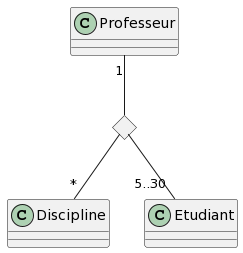

# Diagramme de classe

## Vrai ou faux

Etant donné le diagramme de domaine ci-dessus, les assertions suivantes sont-elles vraies ou fausses ? 
- Etudiant est une classe d’association
> Non
- Un étudiant peut participer à autant de cours qu’il veut
> Oui
- Plusieurs professeurs peuvent enseigner la même discipline
> Non
- Un professeur peut enseigner plusieurs disciplines
> Oui
- Un cours peut être enseigner à 2 étudiants
> Non
- Un cours peut être enseigner à 20 étudiants
> Oui

## Question ouverte

Représentez la même association avec la notation UML « petit losange » 

- Quelles informations perd-on par rapport au diagramme ci-dessus ?
> La classe "Cours" n'est plus représentée textuellement parlant, mais les contraintes données sont toujours
> présentes et valides.

